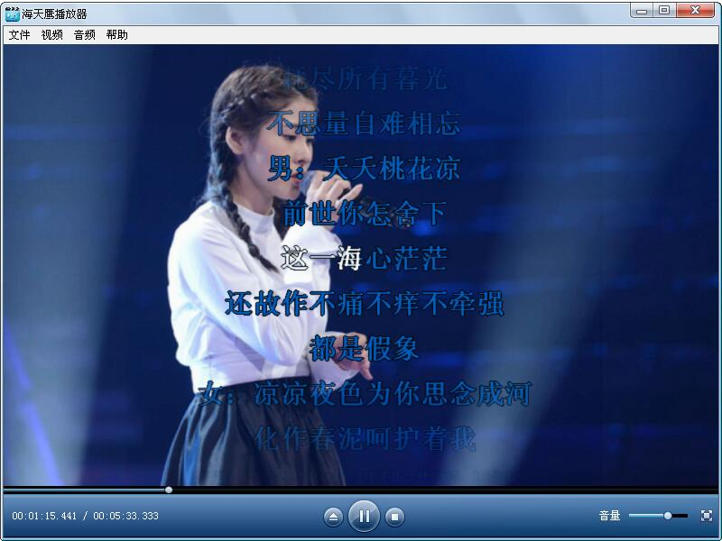

# VB6 海天鹰媒体播放器
Windows 平台基于 VB6 和 APlayer 的媒体播放程序。  
APlayer 支持直播、截图、翻转、歌词、字幕等等，是一个很优秀的轻量级的视频播放引擎。  
官方文档示例是 C 语言写的，和 VB 很不相同，我用 VB6 精简版写了一个，趟过了一些坑点，在 WinXP、Win7 下通过运行，是官方示例的完美补充。

  

## [APlayer](http://aplayer.open.xunlei.com/) 安装方法  
1.官网下载最新SDK，加压后运行 install.bat  
2.官网下载完整解码库，解压缩到 APlayer 安装目录  
3.打开VB6，部件添加 APlayer，拖入窗口，详细语法参考 SDK 文档。

### 演示
歌词：  
  